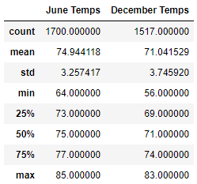

# bootcamp_challenge9
## Overview of the analysis
Weather data stored in the hawaii.sqlite file were extracted and queried to analyze the temperature in June and December. This analysis is used to determine if the weather is ideal for a surf shop.

## Results

Below are the statistics of the temperature records for the Junes and Decembers from the year of 2010 to 2017. 



- The mean temperature in December is nearly 4 degrees lower than June.
- The max temperature in December is only 2 degrees lower than June. However, the min temperature in December is 8 degrees lower than June.
- Therefore, temperature variation is much larger in December than in June, which is consistant with the larger standard deviation for December.

## Summary
Although the December temperature is lower than June in general, but the difference on average is only 4 degrees. And both months are ideal for surfing. <br/>
In addition to temperature, the amount of rainfall measured as daily precipitation is important for the analysis. The following command can be used to query such information from the .sqlite database.

```
june_prcp_results = session.query(Measurement.prcp).\
    filter(extract('month', Measurement.date)==6).all()
dec_prcp_results = session.query(Measurement.prcp).\
    filter(extract('month', Measurement.date)==12).all()
```
The below statistics indicates that both June and December have very small amount rain falls with 75% days less than 0.12 and 0.15 inch, respectively.


Therefore, the weather data indicate the location is ideal for a surf shop.